# Documentation
_This repository contains the documentation of the DevOps Internship. It covers virtualization setup, Ubuntu installation, and the configuration of essential DevOps tools._

___

## 1. Virtualization & OS Installation
### Hypervisor setup
_**VMware Fusion**_ was chosen as the hypervisor due to its stability and performance on macOS.

___

## 2. OS Installation
_**[Ubuntu Server 26.04 LTS](https://ubuntu.com/download/server/arm)**_ was installed inside virtual machine.

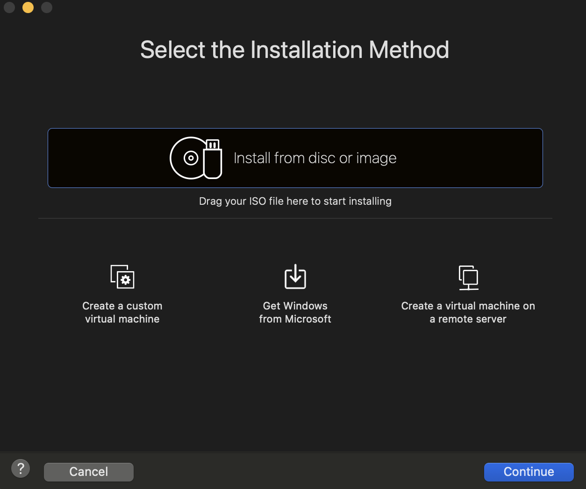

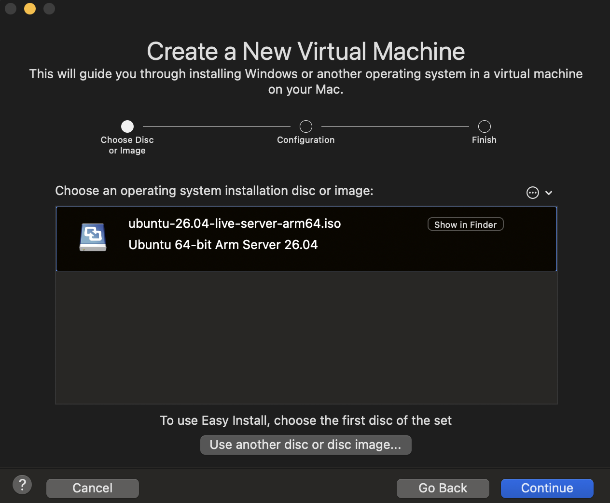

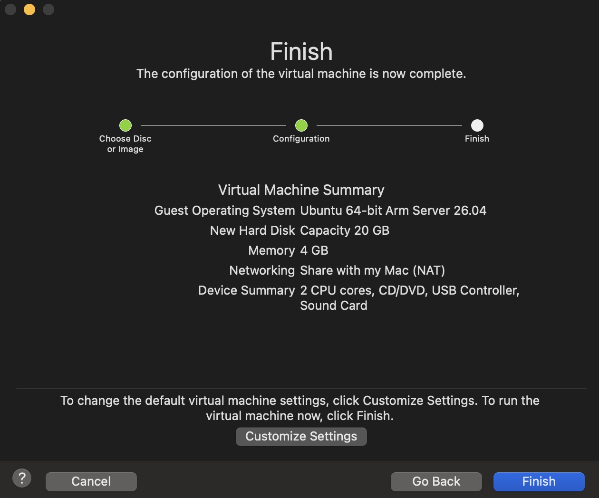

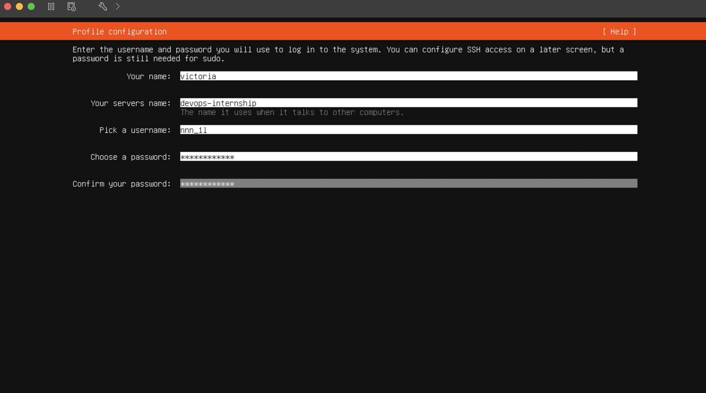

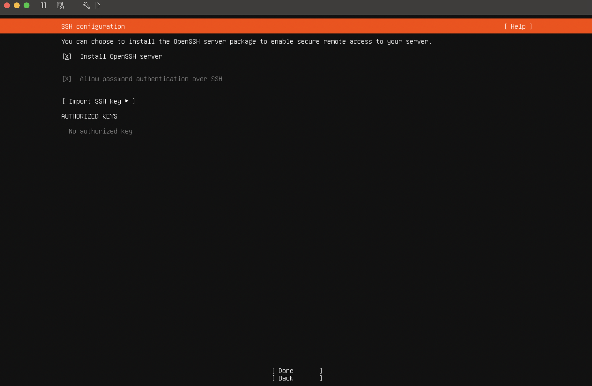

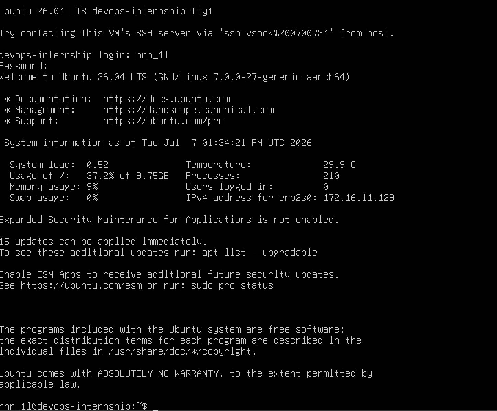

___

## 2. Package Managers & System Updates
Before installing the tools, the system was fully updated using `apt`:
```bash
sudo apt update && sudo apt upgrade -y
```

___

## 3. Installed DevOps tools
### _Git & Github CLI_
To install Git and the official GitHub CLI, run the following commands:
```bash
sudo apt install git -y

sudo mkdir -p -m 755 /etc/apt/keyrings
wget -qO- [https://cli.github.com/packages/githubcli-archive-keyring.gpg](https://cli.github.com/packages/githubcli-archive-keyring.gpg) | sudo tee /etc/apt/keyrings/githubcli-archive-keyring.gpg > /dev/null
sudo chmod go+r /etc/apt/keyrings/githubcli-archive-keyring.gpg
echo "deb [arch=$(dpkg --print-architecture) signed-by=/etc/apt/keyrings/githubcli-archive-keyring.gpg] [https://cli.github.com/packages](https://cli.github.com/packages) stable main" | sudo tee /etc/apt/sources.list.d/github-cli.list > /dev/null

sudo apt update && sudo apt install gh -y
```
Verification:
```bash
git --version
gh --version
```

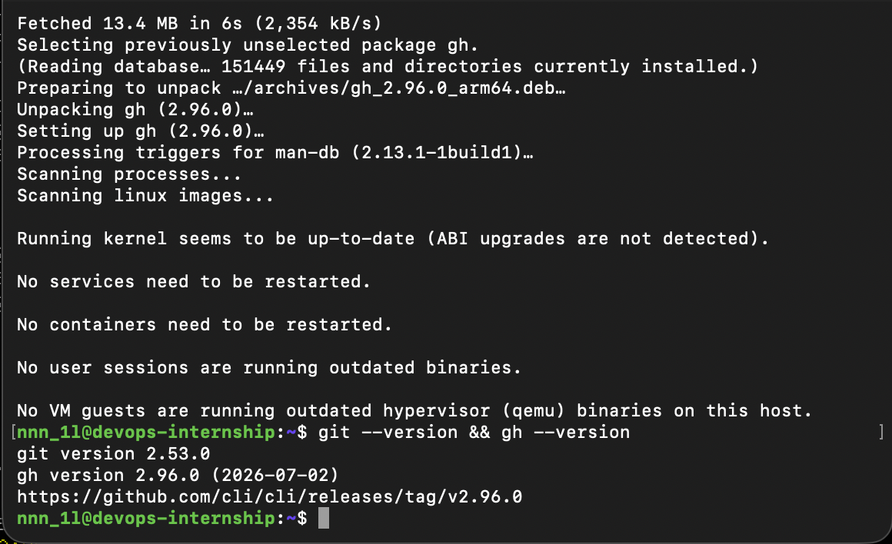

### _Docker & Docker Compose_
To install Docker Engine and the Docker Compose plugin using the official Docker repository, execute:
```bash
for pkg in docker.io docker-doc docker-compose docker-compose-v2 podman-docker containerd runc; do sudo apt-get remove $pkg -y; done

sudo apt-get update && sudo apt-get install ca-certificates curl gnupg -y
sudo install -m 0755 -d /etc/apt/keyrings
curl -fsSL [https://download.docker.com/linux/ubuntu/gpg](https://download.docker.com/linux/ubuntu/gpg) | sudo gpg --dearmor -o /etc/apt/keyrings/docker.gpg
sudo chmod a+r /etc/apt/keyrings/docker.gpg
echo "deb [arch=$(dpkg --print-architecture) signed-by=/etc/apt/keyrings/docker.gpg] [https://download.docker.com/linux/ubuntu](https://download.docker.com/linux/ubuntu) $(. /etc/os-release && echo "$VERSION_CODENAME") stable" | sudo tee /etc/apt/sources.list.d/docker.list > /dev/null

sudo apt-get update && sudo apt-get install docker-ce docker-ce-cli containerd.io docker-buildx-plugin docker-compose-plugin -y

sudo usermod -aG docker $USER
newgrp docker
```
Verification:
```bash
docker version
docker compose version
```

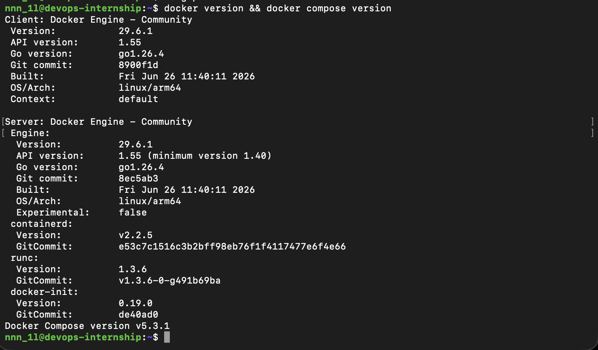

### _Terraform_
To install Terraform on Ubuntu via HashiCorp official repository (with noble distribution compatibility mapping):
```bash
wget -O- [https://apt.releases.hashicorp.com/gpg](https://apt.releases.hashicorp.com/gpg) | sudo gpg --dearmor -o /usr/share/keyrings/hashicorp-archive-keyring.gpg

echo "deb [arch=arm64 signed-by=/usr/share/keyrings/hashicorp-archive-keyring.gpg] [https://apt.releases.hashicorp.com](https://apt.releases.hashicorp.com) noble main" | sudo tee /etc/apt/sources.list.d/hashicorp.list

sudo rm -rf /var/lib/apt/lists/*
sudo apt-get update && sudo apt-get install terraform -y
```
Verification:
```bash
terraform -version
```

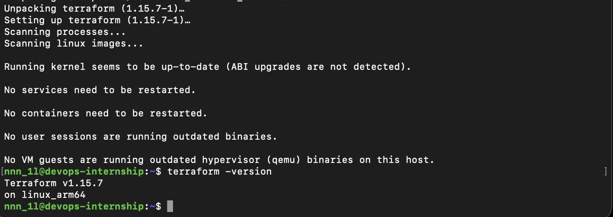

### _AWS CLI v2_
Since this installation runs on an Apple Silicon (ARM64) virtual machine, the official AWS CLI v2 binary bundle compiled for the `aarch64` architecture was deployed:
```bash
sudo apt-get install unzip -y
curl "[https://awscli.amazonaws.com/awscli-exe-linux-aarch64.zip](https://awscli.amazonaws.com/awscli-exe-linux-aarch64.zip)" -o "awscliv2.zip"
unzip awscliv2.zip
sudo ./aws/install

rm -rf aws awscliv2.zip
```
Verification:
```bash
aws --version
```

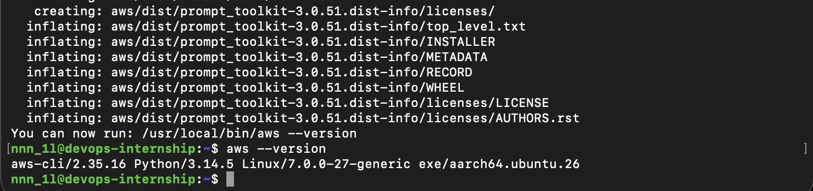

___

#### This repository contains an automated backup solution for a private Git repository using a Bash script running inside a Docker container.

## Project Structure

```text
.
├── backend/            
├── frontend/           
├── traefik/            
├── .env.sample         
├── backup.sh           
├── Dockerfile          
└── README.md           
```

___

## Requirements
- Docker Desktop installed on host machine
- Git and SSH key configured for GitHub access

## Setup & Configuration
### 1. Clone the repository:
```bash
git clone git@github.com:nnn1l/DevOps-Task0.git
cd DevOps-Task0
```

### 2. Copy `.env.sample` to `.env`:
```bash
cp .env.sample .env
```
_Note: Never commit .env to Git._

___

## How to build & run with Docker
### 1. Build th Docker Image
```bash
docker build -t devops-internship .
```

### 2. Run Backup Script
```bash
docker run --rm \
  --env-file .env \
  -v $SSH_AUTH_SOCK:/ssh-agent \
  -e SSH_AUTH_SOCK=/ssh-agent \
  -v ~/backup:/root/backup \
  devops-internship -max-backups 3 -max-runs 1
```

## CLI Optrions (backup.sh)
_The script accepts optional command-line flags:_

`-max-backups <number>`:
- Specifies the number of recent `.tar.gz` archive files to keep in `~/backup`.

- Oldest files are deleted if the threshold is exceeded.

- Passing `0` deletes all archive files.

- Note: `versions.json` logs are preserved and never deleted.

`-max-runs <number>`:
- Runs the backup sequence sequentially `<number>` times in a single execution.

___

## Verifying Backups
_After running the container, check the host machine directory (`~/backup`):_

```bash

ls -la ~/backup


cat ~/backup/versions.json
```

___

#### _This project uses Docker Compose to orchestrate Frontend, Backend, PostgreSQL database, and Traefik reverse proxy._

## Prerequisites

- Docker installed
- Docker Compose installed

## Setup & Running

### 1. Copy environment variables sample file:
``` bash
   cp .env.sample .env
```
   
### 2. Build and start containers in detached mode:
```bash
docker-compose up --build -d
```
   
### 3. Check container status:
```bash
docker-compose ps
```
   
### 4. Verify application availability:

 - Frontend: http://localhost/

 - Backend API Docs: http://localhost/api/docs/

 - Backend Health Check: http://localhost/api/health_check/

5. ### To stop and remove containers:
```bash
docker-compose down
```

___

## 4. DevOps - Task4 (AWS Console & GitHub Actions)
_Work with AWS Console, IAM Users, Roles (OIDC), ECR, S3, and GitHub Actions Pipelines._

### _IAM User Setup_
IAM user created with read-only permissions for review:
- User: `anton-khudyk`
- Attached Policy: `ReadOnlyAccess`

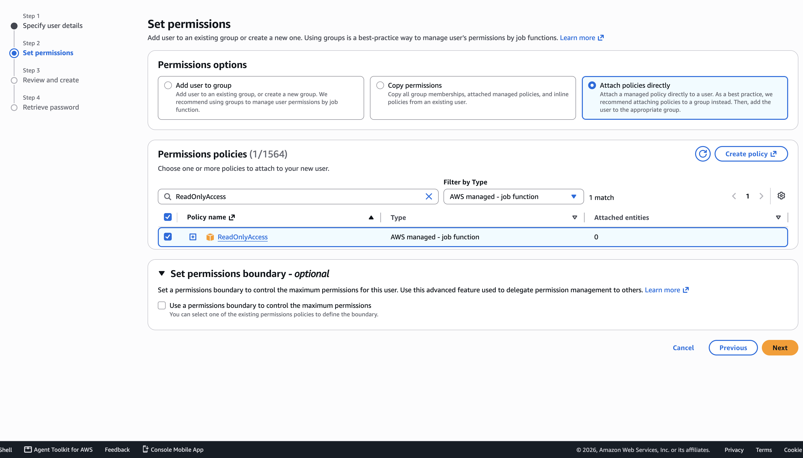

___

### _EC2 Instance & Elastic IP_
Created virtual machine (`t2.micro` / `t3.micro`) with assigned Elastic IP:
- Instance name: `devops-intern-ec2`
- State: Stopped (for next task)


___

### _Private ECR Registries_
Created private registries for container images:
- `frontend`
- `backend`

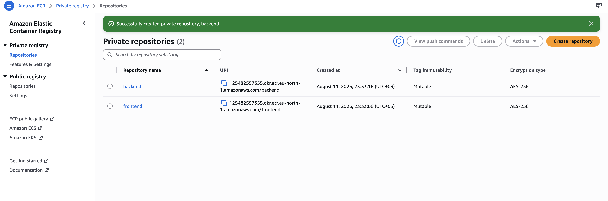

___

### _S3 Bucket_
Created S3 bucket for storing backups and version history:
- Bucket name: `devops-intern-nnn1l-125482557355-eu-north-1-an`

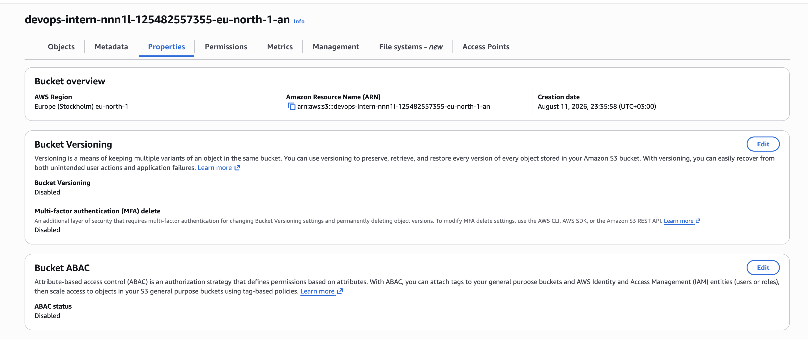

___

### _IAM Roles & OIDC Setup_
Configured passwordless GitHub Actions authentication via AWS OpenID Connect (OIDC) Identity Provider (`token.actions.githubusercontent.com`):
- Role `GitHubActions-DevOpsTask4-Role`: Granular access to ECR (`AmazonEC2ContainerRegistryPowerUser`) and S3 bucket (`s3:PutObject`, `s3:GetObject`, `s3:ListBucket`).
- Role `EC2-ECR-ReadOnly-Role`: Attached to EC2 for ECR read-only access.

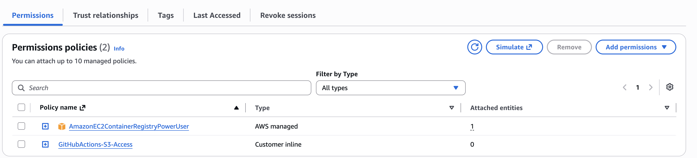
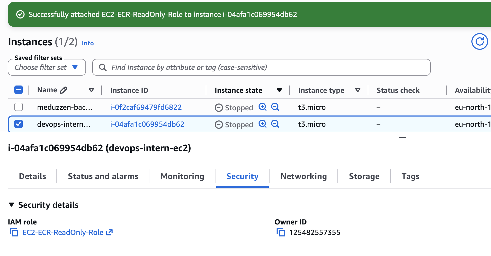

___

## GitHub Actions Workflows

### _1. ECR Image Build and Push (`ecr-push.yml`)_
_Builds Docker images for frontend/backend, tags them with commit SHA and `latest`, and pushes to private ECR:_

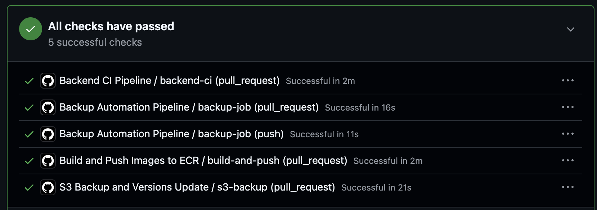


### _2. S3 Backup & Versions Update (`s3-backup.yml`)_
_Executes `backup.sh`, uploads generated `.tar.gz` archive to S3 bucket, syncs `versions.json`, updates build history via Python, and pushes updated version back to S3:_

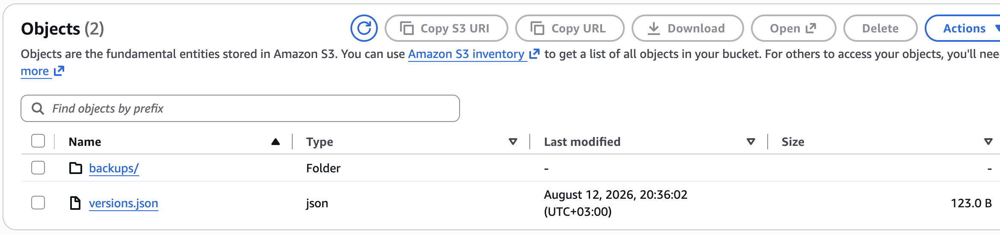

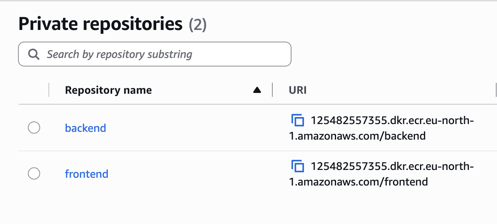

___

## Secrets & Security
_No long-term AWS access keys or sensitive identifiers are stored in the repository. All operations use temporary OIDC session credentials and GitHub Secrets:_
- `AWS_ROLE_TO_ASSUME`
- `AWS_REGION`
- `AWS_S3_BUCKET`

___

## Production Docker Compose Configuration
Created `docker-compose-prod.yaml` using pre-built images from Amazon ECR instead of building on the fly:

```bash
docker compose -f docker-compose-prod.yaml up -d
```

___

### Deployment Pipeline `deploy.yml`
Automates remote deployment to Cloud VM via SSH on `push` to `main` and manual trigger (`workflow_dispatch`):

- Authenticates with AWS ECR using temporary OIDC credentials.

- Establishes secure SSH connection to Cloud VM.

- Deploys docker-compose-prod.yaml and updates .env configuration.

- Pulls target Docker images from private ECR and restarts services.

### Accessing the Application
The application is publicly accessible via cloud VM IP address:

- Frontend Application: http://13.62.74.39

- Backend API: http://13.62.74.39:8000

- API Documentation: http://13.62.74.39:8000/api/docs/

### Connecting via SSH (Local Environment):
``` bash
ssh -i /path/to/key.pem ubuntu@13.62.74.39
```
#### Verification on VM:
```bash
cd ~/app
docker compose -f docker-compose-prod.yaml ps
```